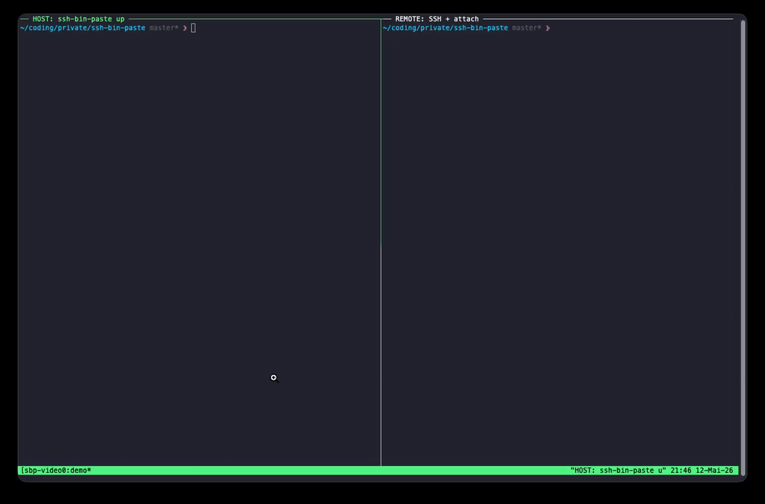

# ssh-bin-paste
Inspired by [@levelsio](https://x.com/levelsio)'s [remote-agent screenshot paste problem](https://x.com/levelsio/status/2053771680317636965):

**Paste images and into remote Claude or Codex CLI sessions over SSH!**
**Drag & drop also works!**

Keep using your normal SSH terminal. No tunnels, no proxies.



## Quickstart
### 1. Install
```sh
curl -fsSL \
  https://raw.githubusercontent.com/henry-p/ssh-bin-paste/master/scripts/install.sh \
  | bash
```

### 2. On the host, start paste capture
```sh
ssh-bin-paste up
```
This installs the required counterpart on the remote. Keep it running.

On first run, you will be asked to enter the ssh command you use to connect to your remote, the shortcut you want to use for pasting files (default is `CMD+SHIFT+V`), and whether to install the macOS login service (default is `no`).

### 3. Run Claude or Codex on your remote and paste file!
```sh
tmux new -s agent
codex
```
Press `CMD+SHIFT+V` (or your configured shortcut) while your SSH terminal is focused → the file will be pasted as if being on your host!
You can also drag a local file into the SSH terminal; if your terminal inserts the host file path, ssh-bin-paste uploads it and rewrites the input to the remote path.

## Commands
| Command | Where | Purpose |
| --- | --- | --- |
| `ssh-bin-paste config` | Host | Set the SSH command, install the remote helper, and add the tmux binding. |
| `ssh-bin-paste up` | Host | Configure on first run, then run the paste shortcut listener. |
| `ssh-bin-paste service install` | Host | Run `ssh-bin-paste up` automatically when you log in. |
| `ssh-bin-paste service status` | Host | Show whether the login service is installed and loaded. |
| `ssh-bin-paste service restart` | Host | Restart the login service. |
| `ssh-bin-paste service uninstall` | Host | Remove the login service. |

## Requirements
**Host**: macOS with Swift available (e.g. via Apple Command Line Tools)\
&nbsp;&nbsp;&nbsp;↓ *SSH*\
**Remote**: `tmux` and Claude Code or Codex

## Coming soon
- Long-running system service
- 
- Windows/Linux support
